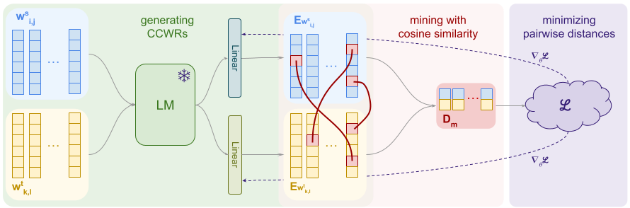

# Improving Low-Resource Languages in Pre-Trained Multilingual Language Models


## Install

```
pip install -r requirements.txt
```

## Run

See `scripts/` for examples scripts:
- `./scripts/example_vocab_extend.sh`: for building vocabulary extended LMs (eBERT)
- `./scripts/example_unsup_alignment.sh`: for unsupervised mining based alignment and evaluation
- `./scripts/example_ner.sh`: for NER evaluation
- `./scripts/mine_word_pairs.sh`: for mining word pairs from a given source and target dataset pair

For further details please look at the relevant scripts and the parameter
descriptions in the used python scripts.

## External Resources and Tools

### Data

We used the following datasets for the experiments:
- Amharic-English data: English - Amharic parallel corpus from https://gourmet-project.eu/data-model-releases/
- Swahili-English data: English - Swahili parallel corpus from https://gourmet-project.eu/data-model-releases/
- Malayalam-English data: English - Malayalam parallel corpus from https://indicnlp.ai4bharat.org/samanantar/
- Maori-English data: English - Maori Bible parallel corpus from https://opus.nlpl.eu/
- Sinhala-English data: English - Sinhala OpenSubtitle data from https://www.statmt.org/wmt19/parallel-corpus-filtering.html
- Sindhi-English data: English - Sindhi Tanzil parallel corpus from https://opus.nlpl.eu/
- Bengali-English data: English - Bengali parallel corpus from https://github.com/csebuetnlp/banglanmt#datasets
- Kannada-English data: English - Kannada parallel corpus from https://indicnlp.ai4bharat.org/samanantar/
- Gujarati-English data: English - Gujarati parallel corpus from https://indicnlp.ai4bharat.org/samanantar/
- Bulgarian-English data: English - Bulgarian parallel corpus from https://www.statmt.org/europarl/
- Afrikaans-English data: English - Afrikaans OpenSubtitles and Bible corpus from https://opus.nlpl.eu/
- Macedonian-English data: English - Macedonian OpenSubtitles corpus from https://opus.nlpl.eu/
- Basque-English data: English - Basque OpenSubtitles corpus from https://opus.nlpl.eu/
- Nepali-English data: English - Nepali Bible corpus from https://opus.nlpl.eu/

### Tokenizers

The datasets are tokenized with the following tools:
- English: Moses Tokenizer: https://github.com/moses-smt/mosesdecoder
- Nepali: Tokenizer and Normalizer from indic-nlp: https://github.com/anoopkunchukuttan/indic_nlp_library
- Swahili: Moses Tokenizer
- Malayalam: Tokenizer and Normalizer from indic-nlp
- Sinhala: Tokenizer and Normalizer from indic-nlp
- Maori: Moses Tokenizer
- Sindhi: Moses Tokenizer
- Amharic: https://github.com/uhh-lt/amharicprocessor
- Gujrati: Tokenizer and Normalizer from indic-nlp
- Kannada: Tokenizer and Normalizer from indic-nlp
- Bengali: Tokenizer and Normalizer from indic-nlp
- Afrikaans: Moses Tokenizer
- Macedonian: Moses Tokenizer
- Basque: Moses Tokenizer
- Bulgarian: Moses Tokenizer
- Nepali: Tokenizer and Normalizer from indic-nlp

## Cite

Related publications:

[1] V. Hangya, H. Shaikh Saadi and A. Fraser, [Improving Low-Resource Languages in Pre-Trained Multilingual anguage Models](#) in Proceedings of the 2022 Conference on Empirical Methods in Natural Language Processing (EMNLP), 2022.


```
@inproceedings{Hangya2022,
author = {Hangya, Viktor and Shaikh Saadi, Hossain and Fraser, Alexander},
title = {{Improving Low-Resource Languages in Pre-Trained Multilingual anguage Models}},
booktitle = {Proceedings of the 2022 Conference on Empirical Methods in Natural Language Processing},
year = {2022}
}

```
